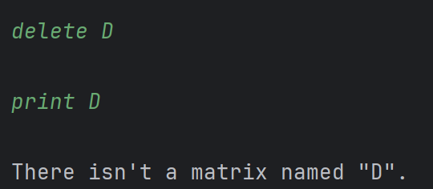

# 1. 选题分工

​	矩阵是线性代数中的重要部分。在数值分析中，矩阵也是一个不断扩大的研究领域。因此，设计一个完备的矩阵类，可以极大方便我们的计算与应用。在本次课程设计中，我们将编写一个矩阵类，并给出一个简单的用户交互系统。

## 1.1 选题要求

1. 设计一个矩阵类，将相应的函数和数据封装在类中，简化程序。
2. 修改程序结构，使程序可以反复执行，直至按键选择退出为止。
3. 本程序用数组表示 $5 \times 5$ 矩阵，将其改为根据输入矩阵的大小动态分配空间 $m \times n$ 来放置数据，其中 $m, n$ 为用户可输入的任意整数。
4. 增加类的构造函数和成员函数，使得矩阵数据既可以用在对象初始化时赋值，也可以通过键盘赋值，还可以通过读数据文件输入。
5. 用模板的形式改写矩阵数据类型，使得矩阵中的数据既可以是整型数据，也可以是浮点型数据，执行程序时，分别定义两个整型矩阵和两个浮点型矩阵进行乘法验证。
6. 完成矩阵的乘法运算，在运算之前判断这两个矩阵能否满足乘法的条件，若不满足，则给出提示信息。

## 1.2 任务分工

​	本次课程设计，由 23 级数学与统计学院的学生陈静波、曾晨祥协作完成。工作量占比约为，陈静波 : 曾晨祥 $= 3 : 2$ 。


# 2. 需求分析

## 2.1. 课题背景

​	为提供直观的矩阵运算工具，帮助理解线性代数中的基本概念（矩阵加减乘、转置、幂运算等）。通过命令行交互，用户可以逐步操作并观察结果，满足简单的矩阵计算要求。用户无需安装专业数学软件，通过命令行即可完成基础矩阵操作。


## 2.2. 总体设计思想

​	该程序实现了一个矩阵计算器，支持多种矩阵操作，包括创建、复制、加减乘除、幂运算等。程序采用面向对象的设计思想，将矩阵操作封装在Matrix类中，并通过命令行界面与用户交互。

​	同时，程序还包含了一些函数式编程的思想，即尽量将逻辑运算表示为一系列的函数调用。这一思想简化了代码的维护过程，避免了大量重复代码的编写，也使得调试变得更加方便。当然，我们的代码与纯粹的函数式编程也有着本质区别，实际上只是借鉴了一些思想。

# 2. 总体设计

​	在本次课程设计中，我们组设计了一个使用 C++ 实现的矩阵计算器程序。为了方便调用，我们将程序分成了两大部分：头文件 `matrix.h` ，以及用户交互系统 `main.cpp` 。以下将详细分析其组成与功能。

## 2.1. 头文件`matrix.h` 

​	对于矩阵类 `Matrix` ，我们将其封装至头文件 `matrix.h` 中，方便我们使用时直接调用。

### 2.1.1. 随机数生成工具

​	由于示例程序中涉及随机矩阵的生成，因此需要一个随机数工具来生成随机数。在这里，我们采用 `std::mt19937` ，并采用 `std::random_device` 作为其种子，从而使得随机数的质量更高。

```cpp
inline mt19937_64 mrand(random_device{}());

inline double rnd() {
    return static_cast<double>(mrand()) / static_cast<double>(numeric_limits<unsigned long long>::max()) * 20 - 10;
}
```


### 2.1.2. 矩阵类私有成员

​	采用 `std::vector` 作为动态数组，方便开辟空间。使用 STL 容器将牺牲一部分性能，但是同样也具备更高的安全性，并且使用更为方便。

​	`n, m` 为矩阵的大小，表示这是一个 $n \times m $ 的矩阵。

```cpp
template<class T>
class Matrix {
private:
    vector<vector<T>> a;
    int n, m;
public:
    //...
};
```


### 2.1.3. 构造函数

​	为了方便使用，我们创建了如下几种构造函数：

- `Matrix()` 创建空矩阵；

  ```cpp
  Matrix() { n = 0; m = 0;}
  ```

  

- `Matrix(initializer_list<initializer_list<T>> b)` 由列表 $b$ 创建矩阵；

  ```cpp
  Matrix(initializer_list<initializer_list<T>> b) {
      for (auto it: b) {
          a.emplace_back(move(it));
      }
      n = a.size();
      m = a[0].size();
  }
  ```

  

- `Matrix(const vector<vector<T2>>& b)` 由二维 `std::vector` 数组 $b$ 创建矩阵。

  ```cpp
  template<class T2>
  explicit Matrix(const vector<vector<T2>>& b) {
      n = b.size();
      m = b[0].size();
      a.resize(n, vector<T>(m));
      for (int i = 0; i < n; i++) {
          for (int j = 0; j < n; j++) {
              a[i][j] = b[i][j];
          }
      }
  }
  ```

  

  

- `Matrix(const Matrix<T2>& b)` 由矩阵 $b$ 创建矩阵。这里的注释是为了消除编译器的 warning。

  ```cpp
  template<class T2>
  // ReSharper disable once CppNonExplicitConvertingConstructor
  Matrix(const Matrix<T2>& b) {
      n = b.Row();
      m = b.Col();
      a.resize(n, vector<T>(m, 0));
      for (int i = 0; i < n; i++) {
          for (int j = 0; j < m; j++) {
              a[i][j] = b.get(i, j);
          }
      }
  }
  ```

  

- `Matrix(int n, int m, const string& ch = "0")` 以 $ch$ 为参数（默认为 `"0"` ），创建 $n \times m$ 的矩阵。其中，参数的含义如下：

  - `"0"` 创建一个全 $0$ 矩阵；
  - `"1"` 创建一个全 $1$​​ 矩阵；
  - `"I"` 创建一个单位矩阵，若矩阵不为方阵则会报错；
  - `"R"` 创建一个随机矩阵（范围在 $[-10, 10]$ ）；
  - `"r"` 从输入中读入矩阵。

  ```cpp
  Matrix(int n, int m, const string& ch = "0") {
      this -> n = n;
      this -> m = m;
      if (ch == "0") {
          a = move(vector<vector<T>>(n, vector<T>(m, 0)));
      }else if (ch == "I") {
          assert(n == m && "initialization failed: n != m");
          a = move(vector<vector<T>>(n, vector<T>(m, 0)));
          for (int i = 0; i < n; i++) {
              a[i][i] = 1;
          }
      }else if (ch == "1") {
          a = move(vector<vector<T>>(n, vector<T>(m, 1)));
      }else if (ch == "R") {
          a = move(vector<vector<T>>(n, vector<T>(m, 0)));
          for (int i = 0; i < n; i++) {
              for (int j = 0; j < m; j++) {
                  a[i][j] = rnd();
              }
          }
      }else if (ch == "r") {
          a = move(vector<vector<T>>(n, vector<T>(m, 0)));
          if (n * m) cout << "Please enter exactly " << n * m << " elements.\n";
          for (int i = 0; i < n; i++) {
              for (int j = 0; j < m; j++) {
                  cin >> a[i][j];
              }
          }
      }else {
          assert(0 && "initialization failed: unknown type");
      }
  }
  ```

  

- `Matrix(int n, int m, const function<T(int, int)>& fun)` 以 `fun` 为构造函数，创建 $n \times m$ 的矩阵；

  ```cpp
  Matrix(int n, int m, const function<T(int, int)>& fun) {
      this -> n = n;
      this -> m = m;
      a = move(vector<vector<T>>(n, vector<T>(m, 0)));
      for (int i = 0; i < n; i++) {
          for (int j = 0; j < m; j++) {
              a[i][j] = fun(i, j);
          }
      }
  }
  ```

  

- `Matrix(int n, string ch = "0")` 以 $ch$ 为参数（默认为 `"0"` ），创建 $n \times n$ 的方阵。

  ```cpp
  explicit Matrix(int n, string ch = "0"): Matrix(n, n, ch) {};
  ```

  

​	以上构造函数基本可以满足全部的使用需求。如果还有额外需求，也可以自行构造函数来生成矩阵，非常方便。此外，对于单参数的构造函数，除了直接由另一个矩阵生成新矩阵以外，构造函数前都加上了 `explicit` 关键字，这是为了防止隐式转换。


### 2.1.4. 矩阵基本操作

​	在矩阵类模板中，我们根据日常使用的需要，定义了如下成员函数：

- `Row()` 获取矩阵的行数。

  ```cpp
  [[nodiscard]] int Row() const {
      return n;
  }
  ```

  

- `Col()` 获取矩阵的列数。

  ```cpp
  [[nodiscard]] int Col() const {
      return m;
  }
  ```

  

- `trace()` 获取矩阵的迹。如果矩阵不是方阵，则会报错。

  ```cpp
  [[nodiscard]] T trace() const {
      if (n != m) {
          assert(0 && "failed to get trace: n != m");
      }
      T sum = 0;
      for (int i = 0; i < n; i++) {
          sum += a[i][i];
      }
      return sum;
  }
  ```

  

- `get(i, j)` 仅读取矩阵的第 $i$ 行，第 $j$ 列的元素。

  ```cpp
  T get(const int& i, const int& j) const {
      return a[i][j];
  }
  ```

  

- `print()` 按照一定的格式输出矩阵，并根据数据类型和大小，智能计算输出的宽度。

  ```cpp
  void print() const {
      cout << "Type = Matrix<" << typeid(T).name() << ">\n";
      cout << "Size = ";
      if (n == 0 && m == 0) {
          cout << "[empty]\n";
      }else {
          cout << n << " x " << m << "\n";
      }
  
      bool f = static_cast<T>(1) / 2 != 0;
  
      auto dig = [](int x) -> int {
          int cnt = 0;
          if (x == 0) cnt++;
          if (x < 0) cnt++;
          while (x) {
              x /= 10;
              cnt++;
          }
          return cnt;
      };
      int sz = 0;
      for (int i = 0; i < n; i++) {
          for (int j = 0; j < m; j++) {
              sz = max(sz, dig(a[i][j]));
          }
      }
      cerr << sz << "\n";
      for (int i = 0; i < n; i++) {
          if (n == 1) {
              cout << " < ";
          }else if (i == 0) {
              cout << " / ";
          }else if (i == n - 1) {
              cout << " \\ ";
          }else {
              cout << " | ";
          }
          for (int j = 0; j < m; j++) {
              if (f) cout << fixed << setprecision(3) << setw(sz + 6) << a[i][j] << " ";
              else cout << setw(sz + 2) << a[i][j] << " ";
          }
          if (n == 1){
              cout << ">";
          }else if (i == 0) {
              cout << "\\";
          }else if (i == n - 1) {
              cout << "/";
          }else {
              cout << "|";
          }
          cout << "\n";
      }
  }
  ```

  

- `trans()` 转置运算，将自身转置后，再返回 `*this` 。

  ```cpp
  Matrix& trans() {
      vector<vector<T>> b(m, vector<T>(n));
      for (int i = 0; i < n; i++) {
          for (int j = 0; j < m; j++) {
              b[j][i] = a[i][j];
          }
      }
      swap(n, m);
      a = move(b);
      return *this;
  }
  ```

  

​	并进行了如下运算符的重载：

- 下标运算符 `[]` 获取一个行向量的引用，即可以直接使用 `a[i][j]` 访问并修改矩阵的元素。

  ```cpp
  vector<T>& operator [](const int& x) {
      return a[x];
  }
  ```

  

- 加法运算符 `+` ，保证数据类型向上兼容；加赋值运算符 `+=` ，数据类型保持不变。若大小不同，则会报错。

  ```cpp
  template<class T2>
  auto operator + (const Matrix<T2>& x) const {
      if (x.Row() != n || x.Col() != m) {
          assert(0 && "failed to do operation \"+\": different sizes");
      }
      Matrix<decltype(a[0][0] + x.get(0, 0))> c(a);
      for (int i = 0; i < n; i++) {
          for (int j = 0; j < m; j++) {
              c[i][j] += x.get(i, j);
          }
      }
      return c;
  }
  
  template<class T2>
  Matrix& operator += (const Matrix<T2>& x) {
      *this = *this + x;
      return *this;
  }
  ```

  

- 减法运算符 `-` ，保证数据类型向上兼容；减赋值运算符 `-=` ，数据类型保持不变。若大小不同，则会报错。

  ```cpp
  template<class T2>
  auto operator - (const Matrix<T2>& x) const {
      if (x.Row() != n || x.Col() != m) {
          assert(0 && "failed to do operation \"-\": different sizes");
      }
      Matrix<decltype(a[0][0] - x.get(0, 0))> c(a);
      for (int i = 0; i < n; i++) {
          for (int j = 0; j < m; j++) {
              c[i][j] -= x.get(i, j);
          }
      }
      return c;
  }
  
  template<class T2>
  Matrix& operator -= (const Matrix<T2>& x) {
      *this = *this - x;
      return *this;
  }
  ```

  

- 乘法运算符 `*` ，保证数据类型向上兼容；乘赋值运算符 `*=` ，数据类型保持不变。若不满足矩阵乘法条件，则会报错。

  ```cpp
  template<class T2>
  auto operator * (const Matrix<T2>& x) const {
      if (x.Row() != m) {
          assert(0 && "failed to do operation \"*\": different sizes");
      }
      Matrix<decltype(a[0][0] * x.get(0, 0))> c(n, x.Col());
      for (int i = 0; i < n; i++) {
          for (int j = 0; j < x.Col(); j++) {
              for (int k = 0; k < m; k++) {
                  c[i][j] += a[i][k] * x.get(k, j);
              }
          }
      }
      return c;
  }
  
  template<class T2>
  Matrix& operator *= (const Matrix<T2>& x) {
      *this = *this * x;
      return *this;
  }
  ```

  

- 比较运算符，判断两个矩阵是否相等，或不相等；

  ```cpp
  template<class T2>
  bool operator == (const Matrix<T2>& x) const {
      if (x.Row() != n || x.Col() != m) return false;
      for (int i = 0; i < n; i++) {
          for (int j = 0; j < m; j++) {
              if (a[i][j] != x[i][j]) return false;
          }
      }
      return true;
  }
  
  template<class T2>
  bool operator != (const Matrix<T2>& x) const {
      return !(*this == x);
  }
  ```

  

​	最后，在矩阵类外，还实现了函数：

- `Matrix<T> pow(Matrix<T> a, int x)` 矩阵幂运算，并采用了快速幂加快运算。

  ```cpp
  template<typename T>
  Matrix<T> pow(Matrix<T> a, int x) {
      if (a.Row() != a.Col()) {
          assert(0 && "failed to do operation pow: different sizes");
      }
      Matrix<T> res(a.Row(), "I");
      while (x) {
          if (x & 1) res *= a;
          a *= a;
          x >>= 1;
      }
      return res;
  }
  ```

  

​	以上就是头文件中的全部内容。


## 2.2. 用户交互系统 `main.cpp` 

​	为了方便演示矩阵类的功能，我们简单实现了一个交互系统，并仿照 Linux 命令行的帮助文档，编写了一个简单版的操作手册，附在了 `main.cpp` 文件末尾的注释里。

​	运行程序后，输入 `help` 也可以获得操作手册。


​	由于涉及到不同数据类型的矩阵的存储问题，这里我们采用 `variant<Matrix<int>, Matrix<double> >` 来实现整型矩阵和浮点型矩阵的统一存储，并利用 `std::map` 来储存名字与矩阵的映射关系。

​	关于用户交互系统的具体命令，已经全部详细记载在操作手册当中。总体来讲，包含如下操作指令：

- 新建矩阵，可选择类型 int（整型）和 double （双精度浮点型）。
- 复制矩阵
- 矩阵加法、减法、乘法运算，以及幂运算
- 按照一定的格式打印矩阵
- 删除矩阵

​	指令的具体使用方法详见操作手册，再下一小节也将给出若干示例。

​	至于用户交互系统的具体代码实现，由于个人能力所限，实现的方法由大量的分支结构组成，总体代码比较冗长。源码（应该）已经上传在附件当中，这里不再详细展开。

# 3. 具体实现

​	在本节中，我们将给出若干个操作示例，来对这个矩阵类以及用户交互系统进行较为全面的展示。为了方便区分用户的输入和程序的输出，我们将采用 Clion 的内置终端，并以截图的形式给出示例。其中，绿色的文字表示用户的输入，白色的文字表示程序的输出。

1. 创建一个命名为 `A` 的 $3 \times 4$ 的零矩阵并打印：

   

2. 先创建一个命名为 `B` 的 $3 \times 4$ 的零矩阵，再打印：

   

3. 手动输入一个命名为 `C` 的 $3 \times 4$ 的矩阵，数据类型为 int ：

   

4. 创建命名为 `D` 的 $4 \times 3$ 全 $1$ 矩阵：

   

5. 创建命名为 `E` 的 $3 \times 3$ 单位矩阵：

   

6. 创建一个命名为 `F` 的 $3 \times 3$ 随机矩阵，数据类型为 double ：

   

7. 将矩阵 `E` 与 `F` 相加并储存为命名为 `E+F` 的矩阵：

   

8. 将 `E` 与 `F` 相减并储存为命名为 `E-F` 的矩阵：

   

9. 将 `C` 与 `D` 相乘并储存为命名为 `C*D` 的矩阵：

   

10. 对 `F` 做二次幂运算并储存为命名为 `F^2` 的矩阵：

    

11. 矩阵 `d` 复制矩阵 `D` 的数据：

    

12. 删除矩阵 `D` ：

    

13. 重新创建一个命名为 `A` 的随机矩阵，并覆盖原有矩阵：

    


# 4. 结果分析

​	总体来讲，这次课程设计的结果比较让人满意，但是缺点同样明显。在本节，我们将对实现的矩阵计算器工具进行优缺点分析，并提出改进空间。

## 4.1. 优点分析

1. 功能丰富

   - 支持多种矩阵操作：创建（`new`）、复制（`copy`）、加法（`add`）、减法（`sub`）、乘法（`mul`）、幂运算（`pow`）、打印（`print`）、删除（`delete`）。

   - 支持不同数据类型（`int`、`double`），并可通过 `-t` 选项指定。

   - 提供多种初始化方式（零矩阵、单位矩阵、随机矩阵、手动输入）。

2. 良好的错误处理

   - 检查矩阵名称是否合法（不能以 `-` 开头）。

   - 检查矩阵是否存在。

   - 检查矩阵运算的维度是否匹配（如乘法要求 `A.col() == B.row()`）。

   - 提供清晰的错误提示，例如：

     ```
     Failed to execute command "mul": different sizes.
     ```


3. 灵活的选项控制
   - 支持 `-p`（打印结果）、`-y`（跳过确认）、`-s`（存储结果到新矩阵）等选项，提高交互效率。

4. 代码结构清晰
   - 使用 `variant` 和 `visit` 处理不同类型的矩阵（`Matrix<int>` 和 `Matrix<double>`），避免重复代码。
   - 矩阵运算（`+`, `-`, `*`）通过模板实现，支持混合类型计算（如 `int` 矩阵 + `double` 矩阵）。

5. 扩展性强

   - 可以通过修改 `matrix.h` 轻松支持新功能（如行列式、逆矩阵等）。

   - 命令解析逻辑（`split`、`read_name` 等）可复用，方便添加新命令。


## 4.2. 缺点分析

1. 缺少关键功能  

   - 无矩阵转置命令。

   - 无迹（trace）计算命令**。**

   - 无行列式、逆矩阵等高级运算。

2. 手动输入矩阵不够友好  
   - 必须通过 `-o r` 选项输入，且需一次性输入所有元素，出错后无法修改，只能从头输入。

3. 错误提示可以更友好 

   - 某些错误信息较模糊

   - 在 `matrix.h` 中使用 `assert` 判断非法情况，将直接终止程序

4. 用户体验问题
   - 不支持多步撤销（如误删矩阵无法恢复）。

 

## 4.3. 改进空间

1. 增加高级功能  

   - 添加 `transpose`、`det`（行列式）、`inv`（逆矩阵）等命令。

   - 支持分步输入矩阵（如逐行输入）。

2. 增强错误处理

   - 替换 `assert` 为友好的错误提示。

   - 增加输入校验（如检查元素是否为数字）。

3. 优化性能

   - 实现更高效的矩阵乘法。

   - 避免不必要的拷贝（如使用移动语义）。

4. 代码重构

   - 将错误提示集中到统一函数（如 `show_error("msg")`）。

   - 代码写的太丑了，一个月后回头再看一遍真的好丑。

# 5. 课程总结

​	在完成这个矩阵计算器项目的过程中，我们遇见并克服了很多难点。这段开发历程带给我的不仅是编程技能的提升，更重要的是对软件开发的深入理解，以及对计算机科学本质的思考。

​	通过本次矩阵计算器的实现，我深刻体会到C++面向对象与模板编程的强大。利用 `std::vector` 和 `std::variant` 管理矩阵数据，实现了类型安全的混合运算；运算符重载让矩阵操作像数学表达式一样直观，如 `mat1 + mat2` 。格式化输出部分通过动态计算列宽和艺术化边框，提升了可读性。

​	最初接触矩阵运算时，我们只是将其视为线性代数课程中的数学概念。通过这个项目，我们真正理解了如何用计算机语言描述数学对象。比如，在编写快速幂算法时，位运算的巧妙应用让我们对算法优化有了更深刻的认识。这种将数学理论转化为可执行代码的过程，极大地锻炼了我们的计算思维能力。

​	调试过程中，主要遇到的麻烦就是 `std::varient` 的使用，这是 C++17 标准库中引入的一种类型安全的联合体，我们自然对其比较陌生。在查阅了相关文档后开始编写，也出现了多次编译错误。但在克服这些挑战后，我们也对这一新增的容器有了更深的理解。

​	遇到的挑战还包括 `std::variant` 的类型推导和边界检查。在这一部分中，采用了 `std::visit` 来简化 `std::varient` 之间的运算，并采用 `auto` 关键字进行解析。由于 c++20 修复了若干 c++17 中存在的问题，原代码直接迁移到 c++17 的环境中会出现一些兼容性问题，这也为我们协作完成代码带来了一些困难。

​	在调试的过程中，编译器也给出了多个弱警告，这些警告虽然不影响程序的运行，但是可能带来一些安全隐患。例如，一些参数应该写为 `const auto&` 的常量引用形式，防止出现不必要的修改；一些类内的函数应该加上 `const` 标识，防止不小心修改 `this` 中的内容；还有一些函数应该加上 `[[nodiscard]]` 标识，防止函数的返回值没有承接的情况。最终，我们的代码实现了 0 warning，这也帮助我们养成了更好代码习惯，提前适应工程化代码风格。

​	这次实践巩固了我对类设计、模板、STL容器的掌握，尤其是资源管理和异常安全的考量。总的来说，将理论转化为实际代码的过程让我收获颇丰。同时，我们的团队协作能力也得到了极大的提升。